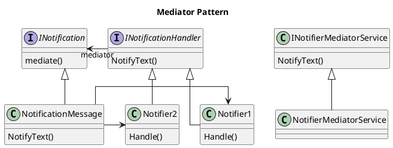

# Definition
Define an object that encapsulates how a set of objects interact. Mediator promotes loose coupling by keeping objects from referring to each other explicitly, and it lets you vary their interaction independently.

## How's this work?
* INotification (Mediator)
  * Defines an interface for communicating with Colleague objects
* Notifier1, Notifier2 are 
  * Each Colleague class knows its Mediator object
  * Each colleague communicates with its mediator whenever it would have otherwise communicated with another colleague
  * Concrete implementations of the task to be performed, 
  * They need to implement the Handler method defined by the INotificationHandler interface.
* NotificationMessage
  * Implements cooperative behavior by coordinating Colleague objects
knows and maintains its colleagues
  * Instantiates the Notifier classes

## Install
Install-Package MediatR

## Reference
* https://github.com/jbogard/MediatR
* https://www.dofactory.com/net/mediator-design-pattern
* https://exceptionnotfound.net/mediator-the-daily-design-pattern/
