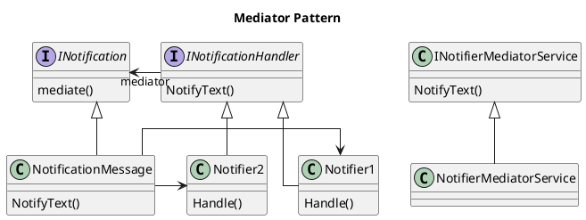

```plantuml
@startuml

skinparam linetype polyline
skinparam linetype ortho

title Mediator Pattern

' classes
interface INotification 
interface INotificationHandler
INotification : mediate()
INotificationHandler : NotifyText()
NotificationMessage : NotifyText()
Notifier1 : Handle()
Notifier2 : Handle()
INotifierMediatorService : NotifyText()

' Set screen position
INotification <- INotificationHandler : mediator
INotification -[hidden]-> NotificationMessage
'INotificationHandler -[hidden]-> Notifier1
'INotificationHandler -[hidden]-> Notifier2
'Notifier1 -[hidden]> Notifier2

' Relationship
NotificationMessage --|> INotification
INotificationHandler <|-- Notifier1
INotificationHandler <|-- Notifier2
NotificationMessage -> Notifier1
NotificationMessage -> Notifier2

INotifierMediatorService <|-- NotifierMediatorService
@enduml
```

## Install
Install-Package MediatR

## Reference
https://github.com/jbogard/MediatR